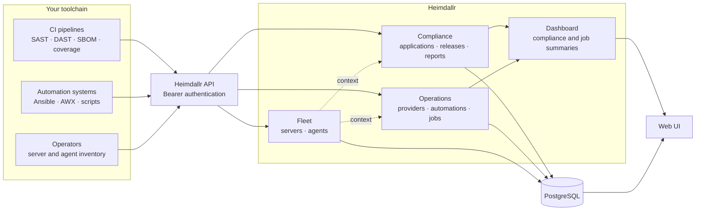
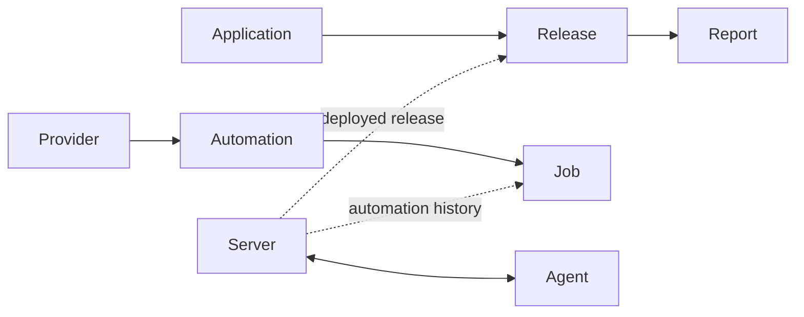

# Heimdallr

Heimdallr gives engineering and operations teams one place to see software
compliance results, automation runs, and server inventory. Existing CI pipelines
and automation tools push their results through the API; Heimdallr organizes
them into searchable records and dashboard summaries.

## What you can track

- **Software compliance** — group SAST, DAST, SBOM, code coverage, and custom
  reports by application and release.
- **Automation activity** — record jobs from Ansible, AWX, or another automation
  system, including status, output, and estimated cost savings.
- **Servers and agents** — maintain an inventory of hosts and the security or
  monitoring agents installed on them.
- **Cross-system context** — associate servers with releases and automation jobs
  to understand where software ran and what changed it.
- **Operational summaries** — view compliance success rates and automation
  outcomes from the dashboard.
- **Controlled API access** — use admin and reader accounts for people, and
  scoped tokens for CI or automation clients.

Heimdallr collects and presents results; it does not run scanners or automation
jobs itself.

## How it works



The data model follows three connected tracks:



## Get started with Docker

Docker Compose starts Heimdallr and PostgreSQL:

```bash
make docker-up
```

Open [http://localhost:8080](http://localhost:8080) and sign in with:

- Username: `root`
- Password: `e2e-test-password`

These credentials are intended for local use. Set
`HEIMDALLR_BOOTSTRAP_ROOT_PASSWORD` to a strong password for any persistent
deployment.

Stop the stack with:

```bash
make docker-down
```

For a source-based setup, frontend development, or test commands, see
[CONTRIBUTING.md](CONTRIBUTING.md).

## Common workflows

### Collect release evidence

Create an application once, then have each pipeline:

1. Upsert the release for its version or commit.
2. Create a report when the scan starts.
3. Update the report with its final status, metadata, and output.

Heimdallr accepts `sast`, `dast`, `sbom`, `code_coverage`, and `custom` reports.
Ready-to-adapt examples are available for
[GitHub Actions](tests/github-actions-sast-push.yaml) and
[Azure DevOps](tests/azure-devops-sbom-push.yaml).

### Record automation jobs

Register a provider and automation, then report each job as it starts and
finishes. The job record keeps the result and output alongside its automation
and related servers. See the
[Ansible/AWX example](tests/awx-output-job.yaml).

### Maintain fleet inventory

Register servers with host, operating system, hypervisor, location, and custom
metadata. Agents can be created independently and attached to one or more
servers, making it possible to find unassigned agents and inspect each host's
tooling.

## Web interface

The web UI is included with the API and provides:

- a dashboard for compliance and automation results;
- application, release, and report views;
- provider, automation, and job views;
- server and agent inventory;
- user administration for admins.

API clients can access the same data using Bearer authentication. Long-lived
tokens can be limited to `application:write`, `automation:write`, `read`, or
`admin` scopes.

## API

The [OpenAPI specification](api/docs/openapi.yaml) is the source of truth for
routes, request bodies, responses, and authentication requirements. Apart from
the health check and login endpoint, all routes require a Bearer token.

Example API and integration material:

- [Postman collection](api/postman_collection.json)
- [GitHub Actions SAST push](tests/github-actions-sast-push.yaml)
- [Azure DevOps SBOM push](tests/azure-devops-sbom-push.yaml)
- [Ansible/AWX job reporting](tests/awx-output-job.yaml)

## Configuration

- `DATABASE_URL` — PostgreSQL connection string (required).
- `HEIMDALLR_BOOTSTRAP_ROOT_PASSWORD` — initial `root` password (minimum 12
  characters). If unset, a generated password is written to the startup log.
- `-server-name` and `-server-port` — bind address; defaults to
  `localhost:8080`.
- HTTP resource limits default to a 5s read-header timeout, 15s read timeout,
  30s write timeout, 60s idle timeout, 1 MiB of headers, 5 MiB request bodies,
  4 MiB of decoded job/report output, and 100 rows per page. Override them with
  `HEIMDALLR_READ_HEADER_TIMEOUT`, `HEIMDALLR_READ_TIMEOUT`,
  `HEIMDALLR_WRITE_TIMEOUT`, `HEIMDALLR_IDLE_TIMEOUT`,
  `HEIMDALLR_MAX_HEADER_BYTES`, `HEIMDALLR_MAX_REQUEST_BODY_BYTES`,
  `HEIMDALLR_MAX_DECODED_OUTPUT_BYTES`, and
  `HEIMDALLR_MAX_PAGINATION_LIMIT`.
- API tokens expire after 90 days by default and may not exceed 365 days.
  Configure shorter periods with `HEIMDALLR_API_TOKEN_DEFAULT_TTL` and
  `HEIMDALLR_API_TOKEN_MAX_TTL`; rotate migrated tokens before their assigned
  deadline.
- Browser sessions use HttpOnly cookies and CSRF tokens. Set
  `HEIMDALLR_COOKIE_SECURE=true` when serving over HTTPS; release/production
  mode refuses an insecure cookie setting. If `HEIMDALLR_CSRF_COOKIE_NAME` is
  customized, build the SPA with the same value in `VITE_CSRF_COOKIE_NAME`.
- `-log-format` — `text` or `json`.
- `-log-level` — `debug`, `info`, `warn`, or `error`.

Database migrations run automatically when the application starts. For local
development and tests, start ephemeral PostgreSQL with `make test-db-up`.

## Contributing

See [CONTRIBUTING.md](CONTRIBUTING.md) for local setup, generated API code,
development guidelines, and the checks required before opening a pull request.

## License

Heimdallr is available under the [MIT License](LICENSE).
