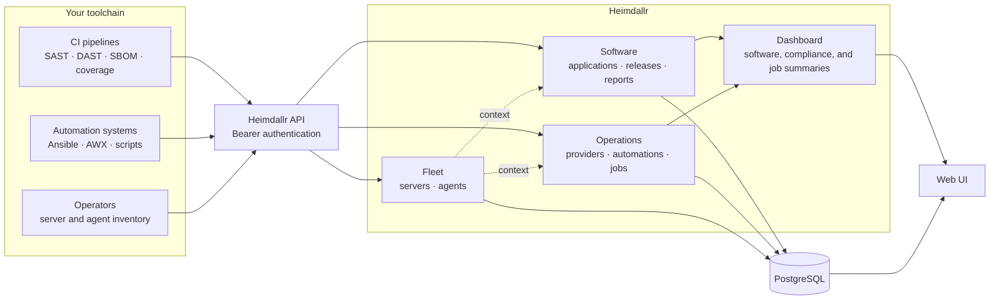
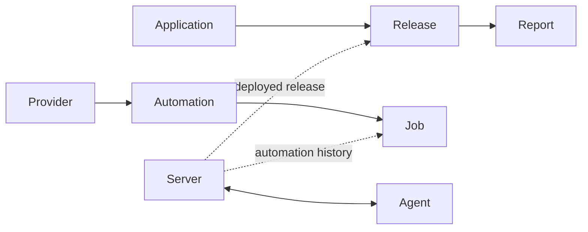

# Heimdallr

Heimdallr gives engineering and operations teams one place to see software
compliance results, automation runs, and server inventory. Existing CI pipelines
and automation tools push their results through the API; Heimdallr organizes
them into searchable records and dashboard summaries.

## What you can track

- **Software compliance** — group SAST, DAST, SBOM, code coverage, and custom
  reports by application and release.
- **Automation activity** — record jobs from Ansible, AWX, or another automation
  system, including status, output, and estimated cost savings.
- **Servers and agents** — maintain an inventory of hosts and the security or
  monitoring agents installed on them.
- **Cross-system context** — associate servers with releases and automation jobs
  to understand where software ran and what changed it.
- **Operational summaries** — view software catalog totals, compliance success rates, and automation
  outcomes from the dashboard.
- **Controlled API access** — use admin and reader accounts for people, and
  scoped tokens for CI or automation clients.

Heimdallr collects and presents results; it does not run scanners or automation
jobs itself.

## How it works



The data model follows three connected tracks:



## Get started with Docker

Docker Compose starts Heimdallr and PostgreSQL:

```bash
make docker-up
```

Open [http://localhost:8080](http://localhost:8080) and sign in with:

- Username: `root`
- Password: `e2e-test-password`

These credentials are intended for local use. Set
`HEIMDALLR_BOOTSTRAP_ROOT_PASSWORD` to a strong password for any persistent
deployment.

Stop the stack with:

```bash
make docker-down
```

For a source-based setup, frontend development, or test commands, see
[CONTRIBUTING.md](CONTRIBUTING.md).

## Common workflows

### Collect release evidence

Create an application once, then have each pipeline:

1. Upsert the release for its version or commit.
2. Create a report when the scan starts.
3. Update the report with its final status, metadata, and output.

Heimdallr accepts `sast`, `dast`, `sbom`, `code_coverage`, and `custom` reports.
Ready-to-adapt examples are available for
[GitHub Actions](tests/github-actions-sast-push.yaml) and
[Azure DevOps](tests/azure-devops-sbom-push.yaml).

### Record automation jobs

Register a provider and automation, then report each job as it starts and
finishes. The job record keeps the result and output alongside its automation
and related servers. See the
[Ansible/AWX example](tests/awx-output-job.yaml).

### Maintain fleet inventory

Register servers with host, operating system, hypervisor, location, and custom
metadata. Agents can be created independently and attached to one or more
servers, making it possible to find unassigned agents and inspect each host's
tooling.

## Web interface

The web UI is included with the API and provides:

- a dashboard for software catalog, compliance, and automation results;
- application, release, and report views;
- provider, automation, and job views;
- server and agent inventory;
- user administration for admins.

API clients can access the same data using Bearer authentication. Long-lived
tokens can be limited to `application:write`, `automation:write`, `read`, or
`admin` scopes.

## API

The [OpenAPI specification](api/docs/openapi.yaml) is the source of truth for
routes, request bodies, responses, and authentication requirements. Apart from
the health check and login endpoint, all routes require a Bearer token.

Example API and integration material:

- [Postman collection](api/postman_collection.json)
- [GitHub Actions SAST push](tests/github-actions-sast-push.yaml)
- [Azure DevOps SBOM push](tests/azure-devops-sbom-push.yaml)
- [Ansible/AWX job reporting](tests/awx-output-job.yaml)

## Configuration

Heimdallr resolves each setting from several sources. When the same value is
set in more than one place, the higher-priority source wins:

1. Built-in defaults (lowest priority)
2. YAML config file (when `-config` is passed)
3. Environment variables
4. Explicit CLI flags (highest priority)

Pass `-config /path/to/config.yaml` to load a YAML file. Omitted file keys fall
through to the next layer. Release-mode checks (`GIN_MODE=release` or
`HEIMDALLR_ENV=production`) read only from the environment and require secure
cookies regardless of file settings.

Example:

```bash
./heimdallr -config /etc/heimdallr/config.yaml
```

| Setting | Flag | Environment variable | Config file key | Default | Description |
| --- | --- | --- | --- | --- | --- |
| Config file path | `-config` | — | — | — | Path to YAML config file |
| Database URL | — | `DATABASE_URL` | `database.url` | — | PostgreSQL connection string (required) |
| Bootstrap root password | — | `HEIMDALLR_BOOTSTRAP_ROOT_PASSWORD` | `auth.bootstrap_root_password` | — | Initial `root` password (min. 12 characters); generated and logged if unset |
| Server host | `-server-name` | — | `server.host` | `localhost` | HTTP bind host |
| Server port | `-server-port` | — | `server.port` | `8080` | HTTP listen port |
| Log format | `-log-format` | — | `logger.format` | `text` | `text` or `json` |
| Log level | `-log-level` | — | `logger.level` | `info` | `debug`, `info`, `warn`, or `error` |
| Read header timeout | — | `HEIMDALLR_READ_HEADER_TIMEOUT` | `server.read_header_timeout` | `5s` | Max time to read request headers |
| Read timeout | — | `HEIMDALLR_READ_TIMEOUT` | `server.read_timeout` | `15s` | Max time to read the full request |
| Write timeout | — | `HEIMDALLR_WRITE_TIMEOUT` | `server.write_timeout` | `30s` | Max time to write the response |
| Idle timeout | — | `HEIMDALLR_IDLE_TIMEOUT` | `server.idle_timeout` | `60s` | Max idle connection time |
| Max header bytes | — | `HEIMDALLR_MAX_HEADER_BYTES` | `server.max_header_bytes` | `1048576` | Maximum request header size (1 MiB) |
| Max request body bytes | — | `HEIMDALLR_MAX_REQUEST_BODY_BYTES` | `server.max_request_body_bytes` | `5242880` | Maximum request body size (5 MiB) |
| Max decoded output bytes | — | `HEIMDALLR_MAX_DECODED_OUTPUT_BYTES` | `server.max_decoded_output_bytes` | `4194304` | Maximum decoded job/report output (4 MiB) |
| Max pagination limit | — | `HEIMDALLR_MAX_PAGINATION_LIMIT` | `server.max_pagination_limit` | `100` | Maximum rows per page (max 100) |
| Login rate limit max | — | `HEIMDALLR_LOGIN_RATE_LIMIT_MAX` | `auth.login_rate_limit_max` | `10` | Max login attempts per window |
| Login rate limit window | — | `HEIMDALLR_LOGIN_RATE_LIMIT_WINDOW` | `auth.login_rate_limit_window` | `15m` | Login rate limit window |
| Login rate limit max keys | — | `HEIMDALLR_LOGIN_RATE_LIMIT_MAX_KEYS` | `auth.login_rate_limit_max_keys` | `10000` | Max tracked login rate limit keys |
| API rate limit IP rate | — | `HEIMDALLR_API_RATE_LIMIT_IP_RATE` | `auth.api_rate_limit_ip_rate` | `20` | Per-IP sustained request rate |
| API rate limit IP burst | — | `HEIMDALLR_API_RATE_LIMIT_IP_BURST` | `auth.api_rate_limit_ip_burst` | `40` | Per-IP burst request allowance |
| API rate limit user rate | — | `HEIMDALLR_API_RATE_LIMIT_USER_RATE` | `auth.api_rate_limit_user_rate` | `50` | Per-user sustained request rate |
| API rate limit user burst | — | `HEIMDALLR_API_RATE_LIMIT_USER_BURST` | `auth.api_rate_limit_user_burst` | `100` | Per-user burst request allowance |
| API rate limit max keys | — | `HEIMDALLR_API_RATE_LIMIT_MAX_KEYS` | `auth.api_rate_limit_max_keys` | `10000` | Max tracked API rate limit keys |
| API rate limit stale TTL | — | `HEIMDALLR_API_RATE_LIMIT_STALE_TTL` | `auth.api_rate_limit_stale_ttl` | `1h` | TTL for stale rate limit entries |
| Session token TTL | — | `HEIMDALLR_SESSION_TOKEN_TTL` | `auth.session_token_ttl` | `24h` | Browser session lifetime |
| API token default TTL | — | `HEIMDALLR_API_TOKEN_DEFAULT_TTL` | `auth.api_token_default_ttl` | `2160h` (90 days) | Default API token lifetime |
| API token max TTL | — | `HEIMDALLR_API_TOKEN_MAX_TTL` | `auth.api_token_max_ttl` | `8760h` (365 days) | Maximum API token lifetime |
| Session cookie name | — | `HEIMDALLR_SESSION_COOKIE_NAME` | `auth.session_cookie_name` | `heimdallr_session` | HttpOnly session cookie name |
| CSRF cookie name | — | `HEIMDALLR_CSRF_COOKIE_NAME` | `auth.csrf_cookie_name` | `heimdallr_csrf` | CSRF cookie name; match `VITE_CSRF_COOKIE_NAME` in the SPA build |
| Cookie secure | — | `HEIMDALLR_COOKIE_SECURE` | `auth.cookie_secure` | `false` (non-release) | Require HTTPS cookies; must be `true` in release/production mode |

Database migrations run automatically when the application starts. For local
development and tests, start ephemeral PostgreSQL with `make test-db-up`.

## Contributing

See [CONTRIBUTING.md](CONTRIBUTING.md) for local setup, generated API code,
development guidelines, and the checks required before opening a pull request.

## License

Heimdallr is available under the [MIT License](LICENSE).
